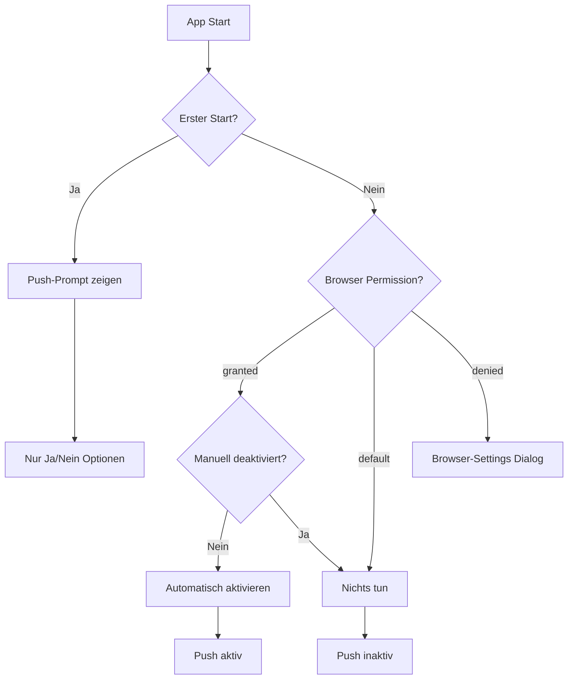

# Push-Notification-System

Ein intelligentes und benutzerfreundliches Push-Notification-System für die Huegelfest PWA.

## Architektur

### Komponenten

1. **`usePushSubscription` Hook** - Zentraler Hook für Push-Subscription-Management mit intelligentem Tracking
2. **`PushNotificationSettings`** - UI-Komponente für Push-Einstellungen
3. **`AutoPushPrompt`** - Dialog für Push-Permission-Anfragen mit kontextueller Nachrichtenwahl
4. **`AutoPushActivator`** - Automatische Push-Aktivierung nach Gerätewechsel
5. **Push Actions** - Server-Actions für API-Kommunikation

### Intelligente Push-Verwaltung

Das System unterscheidet zwischen verschiedenen Nutzerszenarien:

- **Automatische Aktivierung**: Nur wenn Browser-Permission vorhanden UND nie manuell deaktiviert
- **Gerätewechsel-Logik**: Berücksichtigt vorherigen Push-Status auf altem Gerät
- **Manuelle Deaktivierung**: Verhindert unerwünschte automatische Reaktivierung
- **Kontextuelle Nachfragen**: Angepasste Nachrichten je nach Situation

## Push-Notification-Verhalten im Detail

### 1. Erster App-Start

**Automatisches Nachfragen:**
- ✅ Browser-Permission ist `default` (noch nie gefragt)
- ✅ App wurde noch nie gestartet auf diesem Gerät
- 🔔 **Sofortiger Push-Prompt** mit "Ja" / "Nein" Optionen

### 2. Normale App-Nutzung (ohne Gerätewechsel)

**Automatische Aktivierung:**
- ✅ Browser-Permission bereits `granted` 
- ✅ Push-Nachrichten wurden NIE manuell deaktiviert
- ❌ Push-Nachrichten wurden manuell deaktiviert → KEINE automatische Aktivierung

**Manueller Benutzer-Eingriff:**
- **Aktivierung:** Setzt `manually-disabled` Flag zurück
- **Deaktivierung:** Setzt `manually-disabled` Flag (verhindert zukünftige Auto-Aktivierung)

### 3. Gerätewechsel (Device Transfer)

**VEREINFACHT: Keine Push-Nachfragen auf dem alten Gerät!**

Das neue Gerät entscheidet selbst über Push-Benachrichtigungen basierend auf dem normalen "Erster App-Start" Verhalten. Keine komplizierte Übertragung von Push-Status oder Nachfragen auf dem alten Gerät.

### 4. Tracking-System

Das System verwendet localStorage für geräte-spezifisches Tracking:

```typescript
// Manuelle Deaktivierung
`push-manually-disabled-${deviceId}` = 'true'
`push-manually-disabled-timestamp-${deviceId}` = timestamp

// Erster App-Start
`push-asked-before-${deviceId}` = 'true'
```

### 5. Wann werden Nachfragen angezeigt?

**In der gesamten App erscheinen Push-Prompts bei:**

1. **Erster App-Start**
   - Trigger: Browser-Permission ist `default` + noch nie gefragt
   - Ort: Automatisch via `AutoPushPrompt` 
   - Grund: `first-start`
   - Optionen: **Nur "Ja" / "Nein"**

2. **Manuelle Anfrage über Settings**
   - Trigger: Benutzer klickt "Erlauben" Button
   - Ort: `PushNotificationSettings` Komponente
   - Grund: `manual`
   - Optionen: **Nur "Ja" / "Nein"**

### 6. Aktivierungs-Flow Übersicht



## Verwendung

### usePushSubscription Hook

```typescript
import { usePushSubscription } from '@/features/push/hooks/usePushSubscription';

function MyComponent() {
  const {
    isSubscribed,
    isLoading,
    isSupported,
    error,
    subscribe,
    unsubscribe,
    refreshStatus,
    autoActivateIfPermissionGranted
  } = usePushSubscription();

  return (
    <button 
      onClick={isSubscribed ? unsubscribe : subscribe}
      disabled={isLoading || !isSupported}
    >
      {isSubscribed ? 'Deaktivieren' : 'Aktivieren'}
    </button>
  );
}
```

### Manueller Push-Prompt mit custom Message

```typescript
// Event dispatchen um Push-Prompt mit eigener Nachricht anzuzeigen
window.dispatchEvent(new CustomEvent('triggerPushPrompt', {
  detail: { 
    reason: 'device-transfer-ask',
    message: 'Benutzerdefinierte Nachricht hier'
  }
}));
```

### AutoPushActivator Integration

```typescript
// In layout.tsx eingebunden - läuft automatisch
<AutoPushActivator />
<AutoPushPrompt />
```

## Funktionsweise

### 1. Status-Prüfung

Der Hook prüft den Push-Status in mehreren Schritten:

1. **Browser-Permission** - `Notification.permission`
2. **Browser-Subscription** - `pushManager.getSubscription()`
3. **Server-Subscription** - API-Aufruf an Backend
4. **Tracking-Status** - localStorage für manuelle Deaktivierung
5. **Transfer-Status** - localStorage für Device-Transfer-Info

### 2. Automatische Aktivierung

Erfolgt nur wenn ALLE Bedingungen erfüllt sind:
- ✅ Browser unterstützt Push
- ✅ Browser-Permission = `granted`
- ✅ Keine manuelle Deaktivierung in der Vergangenheit
- ✅ Online-Verbindung verfügbar

### 3. Device Transfer Integration

- **Server-seitig**: `magicCodeService.ts` sendet Push-Status-Info
- **Client-seitig**: `DeviceTransferSettings.tsx` empfängt und speichert Status
- **Push-System**: `usePushSubscription.ts` entscheidet basierend auf gespeicherten Daten

## Fehlerbehandlung

- **Offline-Modus**: Lokale Deaktivierung funktioniert, Server-Sync später
- **Server-Fehler**: Stumme Behandlung, keine störenden Error-Toasts
- **Browser-Inkompatibilität**: Graceful Degradation mit informativen Nachrichten

## Besonderheiten

- **Geräte-spezifisches Tracking**: Jede deviceId hat eigene Push-Historie
- **Zeitstempel-Logging**: Für Debugging und potentielle Cleanup-Jobs
- **Event-basierte Kommunikation**: Lose Kopplung zwischen Komponenten
- **Kontextuelle UX**: Nachrichten passen sich der Situation an

## Konfiguration

### Umgebungsvariablen

```env
NEXT_PUBLIC_VAPID_PUBLIC_KEY=your_vapid_public_key
```

### Service Worker

Der Service Worker muss Push-Events verarbeiten:

```javascript
self.addEventListener('push', function(event) {
  const data = event.data.json();
  
  event.waitUntil(
    self.registration.showNotification(data.title, {
      body: data.body,
      icon: '/icon-192x192.png',
      badge: '/badge-96x96.png'
    })
  );
});
```

## Best Practices

### 1. Einfachheit vor Komplexität
- Direkte API-Calls statt komplexer Caching-Systeme
- Standard React-Patterns verwenden
- Keine vorzeitige Optimierung

### 2. Benutzerfreundlichkeit
- Keine automatischen Popups
- Klare Fehlermeldungen
- Respektvoller Umgang mit User-Permissions

### 3. Fehlerbehandlung
- Graceful Degradation bei fehlendem Browser-Support
- Cleanup bei inkonsistenten States
- Aussagekräftige Error-Messages

### 4. Performance
- Lazy Loading von Push-Komponenten
- Minimale Re-Renders durch optimierte Dependencies
- Effiziente State-Updates

## Debugging

### Development-Mode

Im Development-Mode ist ein Debug-Panel verfügbar:

```typescript
// Zeigt Debug-Informationen an
{
  isSupported: boolean,
  isSubscribed: boolean,
  isLoading: boolean,
  error: string | null,
  deviceId: string,
  permission: NotificationPermission
}
```

### Häufige Probleme

1. **"Permission denied"** - User hat Notifications abgelehnt
   - Lösung: Browser-Einstellungen zurücksetzen oder andere Domain verwenden

2. **"Service Worker not ready"** - Service Worker noch nicht registriert
   - Lösung: Warten auf `navigator.serviceWorker.ready`

3. **"VAPID key missing"** - Umgebungsvariable nicht gesetzt
   - Lösung: `NEXT_PUBLIC_VAPID_PUBLIC_KEY` in `.env.local` setzen

## Migration von komplexer Version

Falls du von einer komplexeren Version migrierst:

1. **Cache-Daten löschen**:
   ```javascript
   localStorage.removeItem('push-subscription-cache');
   localStorage.removeItem('push-permission-state');
   localStorage.removeItem('push-last-check');
   ```

2. **Event-Listener entfernen** - Keine custom Events mehr nötig

3. **Komponenten aktualisieren** - Neue Hook-API verwenden

## Fazit

Diese vereinfachte Version bietet:

- ✅ Zuverlässige Push-Notifications
- ✅ Einfache Wartung und Debugging
- ✅ Gute Performance ohne Over-Engineering
- ✅ Klare, verständliche Codebase
- ✅ Standard React/Next.js Patterns 